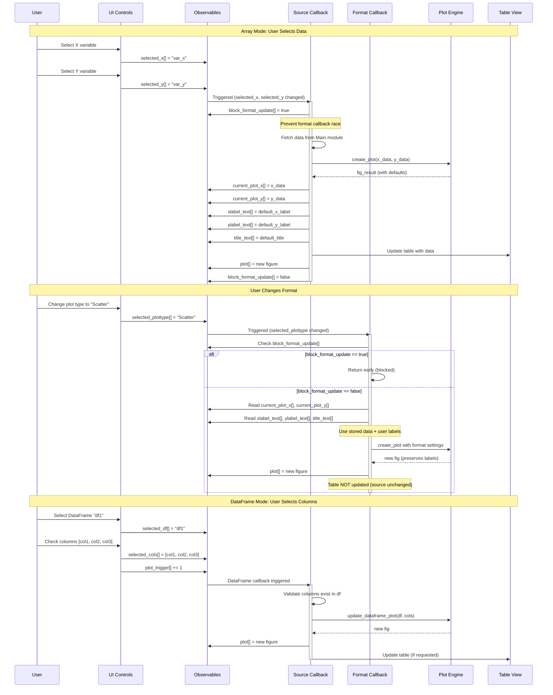

# Callback Execution Sequence

This sequence diagram shows how Observable changes trigger callbacks and how race conditions are prevented.

```mermaid
sequenceDiagram
    participant User
    participant UI as UI Controls
    participant Obs as Observables
    participant SourceCB as Source Callback
    participant FormatCB as Format Callback
    participant Plot as Plot Engine
    participant Table as Table View
    
    %% Initial Data Selection
    Note over User,Table: Array Mode: User Selects Data
    User->>UI: Select X variable
    UI->>Obs: selected_x[] = "var_x"
    
    User->>UI: Select Y variable
    UI->>Obs: selected_y[] = "var_y"
    
    Obs->>SourceCB: Triggered (selected_x, selected_y changed)
    activate SourceCB
    
    SourceCB->>Obs: block_format_update[] = true
    Note over SourceCB: Prevent format callback race
    
    SourceCB->>SourceCB: Fetch data from Main module
    SourceCB->>Plot: create_plot(x_data, y_data)
    Plot-->>SourceCB: fig_result (with defaults)
    
    SourceCB->>Obs: current_plot_x[] = x_data
    SourceCB->>Obs: current_plot_y[] = y_data
    SourceCB->>Obs: xlabel_text[] = default_x_label
    SourceCB->>Obs: ylabel_text[] = default_y_label
    SourceCB->>Obs: title_text[] = default_title
    
    SourceCB->>Table: Update table with data
    SourceCB->>Obs: plot[] = new figure
    
    SourceCB->>Obs: block_format_update[] = false
    deactivate SourceCB
    
    %% Format Change
    Note over User,Table: User Changes Format
    User->>UI: Change plot type to "Scatter"
    UI->>Obs: selected_plottype[] = "Scatter"
    
    Obs->>FormatCB: Triggered (selected_plottype changed)
    activate FormatCB
    
    FormatCB->>Obs: Check block_format_update[]
    alt block_format_update == true
        FormatCB->>FormatCB: Return early (blocked)
    else block_format_update == false
        FormatCB->>Obs: Read current_plot_x[], current_plot_y[]
        FormatCB->>Obs: Read xlabel_text[], ylabel_text[], title_text[]
        Note over FormatCB: Use stored data + user labels
        
        FormatCB->>Plot: create_plot with format settings
        Plot-->>FormatCB: new fig (preserves labels)
        
        FormatCB->>Obs: plot[] = new figure
        Note over FormatCB: Table NOT updated (source unchanged)
    end
    deactivate FormatCB
    
    %% DataFrame Mode
    Note over User,Table: DataFrame Mode: User Selects Columns
    User->>UI: Select DataFrame "df1"
    UI->>Obs: selected_df[] = "df1"
    
    User->>UI: Check columns [col1, col2, col3]
    UI->>Obs: selected_cols[] = [col1, col2, col3]
    UI->>Obs: plot_trigger[] += 1
    
    Obs->>SourceCB: DataFrame callback triggered
    activate SourceCB
    SourceCB->>SourceCB: Validate columns exist in df
    SourceCB->>Plot: update_dataframe_plot(df, cols)
    Plot-->>SourceCB: new fig
    SourceCB->>Obs: plot[] = new figure
    SourceCB->>Table: Update table (if requested)
    deactivate SourceCB
```
