# High-Level User Flow

This flowchart shows the main user paths through the application, highlighting the two distinct data input modes (Array and DataFrame), optional range selection for data subsetting, file import with configurable reading options (header, skip rows, delimiter), reload functionality, and Save functionality.

```mermaid
flowchart TD
    Start([Launch casualplots_app]) --> TabSelect{Select Data Source Type}
    
    TabSelect -->|Array Tab| ArrayMode[Array Mode]
    TabSelect -->|DataFrame Tab| DFMode[DataFrame Mode]
    TabSelect -->|Open Tab| OpenMode[Open File Tab]

    %% Open File Flow
    OpenMode --> ConfigOptions[Configure Reading Options]
    ConfigOptions --> SelectFile[Click Open File Button]
    SelectFile --> HandleClick[handle_open_file_click]
    HandleClick --> FileType{File Type?}
    FileType -->|CSV/TSV| LoadCSV[load_csv_to_table]
    FileType -->|XLSX| ShowSheets[Show Sheet Dropdown]
    ShowSheets --> SelectSheet[User Selects Sheet]
    SelectSheet --> LoadXLSX[load_xlsx_sheet_to_table]
    LoadCSV --> SkipRows[skip_rows!]
    LoadXLSX --> SkipRows
    SkipRows --> NormalizeLoad[normalize_strings!]
    NormalizeLoad --> StoreDF[Store in opened_file_df + opened_file_path]
    StoreDF --> DFMode
    
    %% Reload Flow
    ConfigOptions --> ReloadBtn{Reload Button}
    ReloadBtn -->|File Loaded| ReloadFile[Reload with New Options]
    ReloadFile --> FileType
    ReloadBtn -->|No File| ConfigOptions
    
    %% Array Mode Flow
    ArrayMode --> SelectX[Select X Variable from Dropdown]
    SelectX --> SelectY[Select Y Variable from Dropdown]
    SelectY --> ValidateArrays{Both X & Y Valid?}
    ValidateArrays -->|No| WaitArrays[Wait for Selection]
    ValidateArrays -->|Yes| UpdateBounds[Update Data Bounds Display]
    UpdateBounds --> OptionalRange{User Sets Range?}
    OptionalRange -->|Optional| SetRange[Enter range_from / range_to]
    SetRange --> FetchData
    OptionalRange -->|Skip| FetchData[Fetch Data from Main Module]
    FetchData --> ApplyRange[Apply Range Slicing]
    ApplyRange --> CreatePlot[Generate Plot with Default Labels]
    CreatePlot --> DisplayPlot[Display Plot + Table]
    
    %% DataFrame Mode Flow
    DFMode --> SelectDF["Select DataFrame (Main or Opened File)"]
    SelectDF --> ValidateDF{DataFrame Valid?}
    ValidateDF -->|No| WaitDF[Wait for Selection]
    ValidateDF -->|Yes| UpdateDFBounds[Update Data Bounds Display]
    UpdateDFBounds --> ShowCols[Display Column Checkboxes]
    ShowCols --> SelectCols[Select Columns via Checkboxes]
    SelectCols --> OptionalDFRange{User Sets Range?}
    OptionalDFRange -->|Optional| SetDFRange[Enter range_from / range_to]
    SetDFRange --> TriggerPlot
    OptionalDFRange -->|Skip| TriggerPlot[Click Re-Plot Button]
    TriggerPlot --> ValidateCols{Columns Valid?}
    ValidateCols -->|No| Error[Show Error]
    ValidateCols -->|Yes| NormalizeNumeric[Normalize Numeric Columns]
    NormalizeNumeric --> ApplyDFRange[Apply Range Slicing]
    ApplyDFRange --> WarnDirty{Data Issues?}
    WarnDirty -->|Yes| ShowDirtyWarning[Show Warning Popup]
    WarnDirty -->|No| CreateDFPlot
    ShowDirtyWarning --> CreateDFPlot[Generate DataFrame Plot]
    CreateDFPlot --> DisplayDFPlot[Display Plot + Table]
    
    %% Format Updates
    DisplayPlot --> FormatControls[Format Controls Available]
    DisplayDFPlot --> FormatControls
    FormatControls --> UserEdit{User Edits Format?}
    UserEdit -->|Plot Type| ReplotType[Replot with New Type]
    UserEdit -->|Legend Toggle| ReplotLegend[Replot with Legend On/Off]
    UserEdit -->|Labels| UpdateLabels[Update Axis/Title Labels]
    UserEdit -->|Legend Title| ReplotLegendTitle[Replot with New Legend Title]
    
    ReplotType --> RefreshPlot[Refresh Plot Display]
    ReplotLegend --> RefreshPlot
    UpdateLabels --> RefreshPlot
    ReplotLegendTitle --> RefreshPlot
    
    RefreshPlot --> FormatControls
    
    %% Save Flow
    DisplayPlot --> SaveTab[Save Tab Available]
    DisplayDFPlot --> SaveTab
    SaveTab --> SaveAction{User Save Action}
    SaveAction -->|File Dialog Button| FileDialog[Open OS File Dialog]
    FileDialog --> PathSelected[Path Selected]
    SaveAction -->|Type Path| TypePath[Type Path in Textarea]
    PathSelected --> SaveButton[Click Save Button]
    TypePath --> SaveButton
    SaveButton --> ValidatePath{Path Valid?}
    ValidatePath -->|No| ShowPathError[Show Error Modal]
    ValidatePath -->|Yes| CheckExists{File Exists?}
    CheckExists -->|No| DoSave[Save Plot via CairoMakie]
    CheckExists -->|Yes| ConfirmOverwrite{Show Confirm Modal}
    ConfirmOverwrite -->|Cancel| SaveTab
    ConfirmOverwrite -->|Overwrite| DoSave
    DoSave --> SaveSuccess[Show Success Modal]
    ShowPathError -->|Click OK| SaveTab
    SaveSuccess -->|Click OK| SaveTab
    
    %% Export
    DisplayPlot -.->|Exported to Main| GlobalVars[cp_figure, cp_figure_ax]
    DisplayDFPlot -.->|Exported to Main| GlobalVars
    
    style Start fill:#e1f5ff
    style DisplayPlot fill:#d4edda
    style DisplayDFPlot fill:#d4edda
    style Error fill:#f8d7da
    style ShowPathError fill:#f8d7da
    style ConfirmOverwrite fill:#fff3cd
    style GlobalVars fill:#fff3cd
    style SaveSuccess fill:#d4edda
    style ConfigOptions fill:#e8f4fd
```

