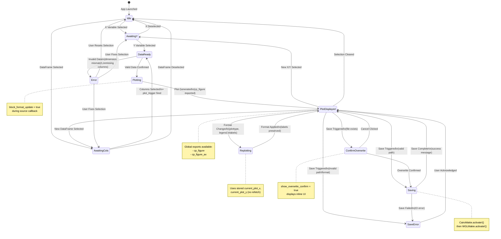

# State Transition Map

This state diagram shows the application's reactive states and what triggers transitions between them.

```mermaid
stateDiagram-v2
    [*] --> Idle: App Launched
    
    Idle --> AwaitingY: X Variable Selected
    Idle --> AwaitingCols: DataFrame Selected
    
    AwaitingY --> DataReady: Y Variable Selected
    AwaitingY --> Idle: X Deselected
    
    AwaitingCols --> DataReady: Columns Selected\n+ plot_trigger fired
    AwaitingCols --> Idle: DataFrame Deselected
    
    DataReady --> Plotting: Valid Data Confirmed
    DataReady --> Error: Invalid Data\n(dimension mismatch,\nmissing columns)
    
    Plotting --> PlotDisplayed: Plot Generated\n(cp_figure exported)
    
    PlotDisplayed --> Replotting: Format Changed\n(plottype, legend,\nlabels)
    
    Replotting --> PlotDisplayed: Format Applied\n(labels preserved)
    
    PlotDisplayed --> AwaitingY: New X/Y Selected
    PlotDisplayed --> AwaitingCols: New DataFrame Selected
    PlotDisplayed --> Idle: Selection Cleared
    
    %% Save Flow
    PlotDisplayed --> Saving: Save Triggered\n(valid path)
    PlotDisplayed --> SaveError: Save Triggered\n(invalid path/format)
    PlotDisplayed --> ConfirmOverwrite: Save Triggered\n(file exists)
    
    ConfirmOverwrite --> Saving: Overwrite Confirmed
    ConfirmOverwrite --> PlotDisplayed: Cancel Clicked
    
    Saving --> PlotDisplayed: Save Complete\n(success message)
    Saving --> SaveError: Save Failed\n(IO error)
    
    SaveError --> PlotDisplayed: User Acknowledged
    
    Error --> Idle: User Resets Selection
    Error --> AwaitingY: User Fixes Selection
    Error --> AwaitingCols: User Fixes Selection
    
    note right of Plotting
        block_format_update = true
        during source callback
    end note
    
    note right of Replotting
        Uses stored current_plot_x,
        current_plot_y (no refetch)
    end note
    
    note right of PlotDisplayed
        Global exports available:
        - cp_figure
        - cp_figure_ax
    end note
    
    note right of Saving
        CairoMakie.activate!()
        then WGLMakie.activate!()
    end note
    
    note right of ConfirmOverwrite
        show_overwrite_confirm = true
        displays inline UI
    end note
```
