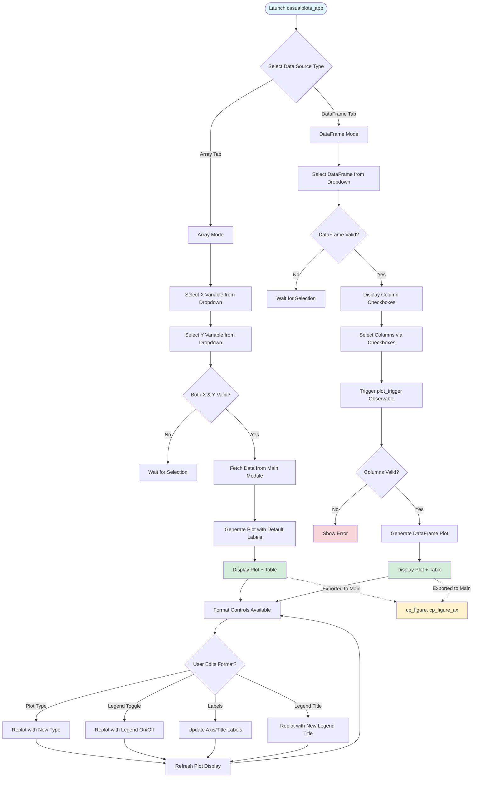
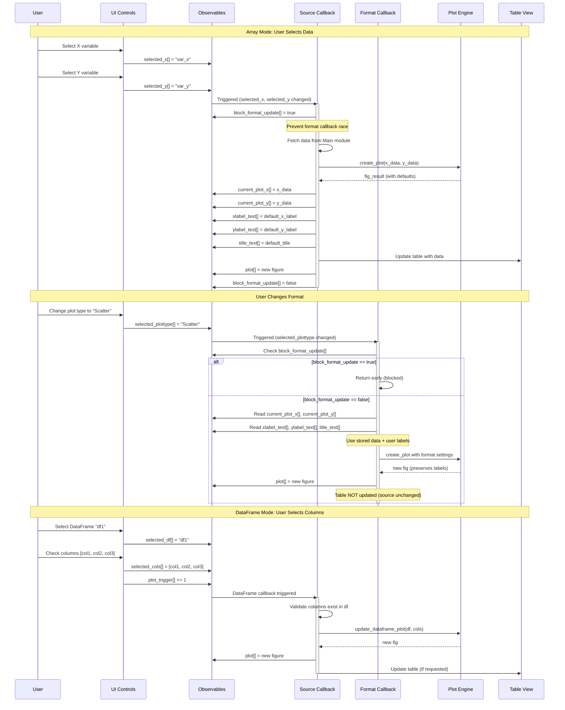
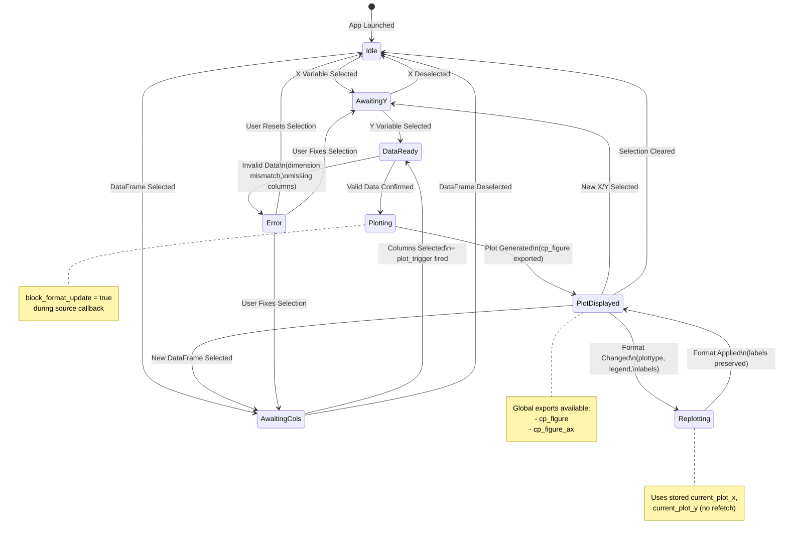

# CasualPlots.jl - AI Agent Technical Reference

## Package Overview
**CasualPlots.jl** is a GUI-based plotting application for Julia that bridges script-based plotting (Makie.jl) and standalone GUI applications (Origin, Veusz). Target users are experimental scientists and engineers needing quick visualization without memorizing syntax. Aims to cover 60-80% of common 2D plotting needs (Scatter, Line, BarPlot).

## Core Architecture

### Technology Stack
*   **[Bonito.jl](https://github.com/SimonDanisch/Bonito.jl)**: Web-based reactive GUI framework
*   **[WGLMakie](https://github.com/MakieOrg/Makie.jl)**: WebGL-based plotting backend
*   **[AlgebraOfGraphics.jl](https://github.com/MakieOrg/AlgebraOfGraphics.jl)**: Declarative plot specification (all plots use AoG exclusively)
*   **[DataFrames.jl](https://github.com/JuliaData/DataFrames.jl)**: Data handling
*   **[Observables.jl](https://github.com/JuliaGizmos/Observables.jl)**: Reactive state management
*   **[Electron.jl](https://github.com/davidanthoff/Electron.jl)**: Window hosting 

### File Structure (src/)
```
CasualPlots.jl                  # Main module, exports casualplots_app()
app.jl                          # Main app entry point (casualplots_app function)
app_helpers.jl                  # Helper functions for app assembly
collect_data.jl                 # Data collection from Main module
create_demo_data.jl             # Demo data generation
dropdowns_setup.jl              # Dropdown menu initialization
create_control_panel_ui.jl      # Control panel UI construction
create_control_panel_ui_helpers.jl  # UI component helpers
tabs_component.jl               # Tab-based UI organization
setup_callbacks.jl              # Core reactive callbacks (source, format, DataFrame)
label_update_callbacks.jl       # Label text field callbacks
plotting.jl                     # Plot generation using AlgebraOfGraphics
electron.jl                     # Electron window integration
scripts/                        # Example/demo scripts
```

### Reactive State Architecture

#### State Structure
The application uses a `NamedTuple` called `state` containing all reactive `Observable` objects:

```julia
state = (
    selected_x::Observable{Union{String,Nothing}},
    selected_y::Observable{Union{String,Nothing}},
    plot_format = (
        selected_plottype::Observable{String},
        show_legend::Observable{Bool}
    ),
    plot_handles = (
        xlabel_text::Observable{String},
        ylabel_text::Observable{String},
        title_text::Observable{String},
        legend_title_text::Observable{String},
        current_figure::Observable{Union{Figure,Nothing}},
        current_axis::Observable{Union{Axis,Nothing}}
    ),
    block_format_update::Observable{Bool},  # Race condition prevention
    # DataFrame mode
    selected_df::Observable{Union{String,Nothing}},
    selected_cols::Observable{Vector{String}}
)
```

#### Output Observables
Separate `outputs` NamedTuple for UI display:
```julia
outputs = (
    plot::Observable{Any},           # DOM element for plot pane
    table::Observable{Any},          # DOM element for table pane
    current_x::Observable{Any},      # Currently plotted X data
    current_y::Observable{Any}       # Currently plotted Y data
)
```

## Developer Diagrams

### High-Level User Flow

This flowchart shows the main user paths through the application, highlighting the two distinct data input modes (Array and DataFrame).



### Callback Execution Sequence

This sequence diagram shows how Observable changes trigger callbacks and how race conditions are prevented.



### State Transition Map

This state diagram shows the application's reactive states and what triggers transitions between them.



### Critical Implementation Patterns

#### 1. Callback Separation (setup_callbacks.jl)
**Two distinct callback chains prevent race conditions:**

**A. Source Callback** (`setup_source_callback`):
- Triggered by: `selected_x`, `selected_y` changes
- Responsibilities:
  - Fetch data from `Main` module
  - Generate initial plot with **default labels**
  - Update `current_plot_x`, `current_plot_y`
  - **Block format callback** during execution (`state.block_format_update[] = true`)
  - Update table view
  - Clear state on invalid selection

**B. Format Callback** (`setup_format_callback`):
- Triggered by: `selected_plottype`, `show_legend`, `legend_title_text` changes
- Responsibilities:
  - Replot using **stored data** (`current_plot_x[]`, `current_plot_y[]`)
  - Apply **user-modified labels** from text fields
  - **Does NOT update table** (source-dependent only)
  - **Returns early** if `block_format_update[] == true`

**C. DataFrame Callback** (`setup_dataframe_callbacks`):
- Triggered by: `plot_trigger` observable (manually triggered after checkbox updates)
- Uses: `update_dataframe_plot` helper function
- Special parameters:
  - `reset_legend_title=true` for new DataFrame plots
  - `update_table=true` only for new data selection

#### 2. Label Persistence Strategy
**Critical pattern for preventing label overwrites:**

```julia
# In source callback (setup_source_callback):
# Generate plot with DEFAULT labels
fig_result = check_data_create_plot(x, y; plot_format)

# Then UPDATE text fields from generated defaults
xlabel_text[] = fig_result.fig_params.x_name
ylabel_text[] = fig_result.fig_params.y_name
title_text[] = fig_result.fig_params.title

# In format callback (setup_format_callback):
# USE EXISTING text field values (preserves user edits)
xlabel_text_val = xlabel_text[]
ylabel_text_val = ylabel_text[]
# ... apply these to axis
```

#### 3. Legend Behavior
- **Default visibility**: `show_legend = (n_cols > 1)` for multi-column data
- **Initial state**: Checkbox reflects default, legend title empty
- **User override**: Checkbox changes persist through format updates
- **Reset trigger**: Only on new data selection (source change)

#### 4. DataFrame Column Selection
**Special handling to avoid race conditions:**
- Uses manual `plot_trigger::Observable{Int}` instead of direct checkbox observation
- Checkbox changes don't trigger immediate plot update
- After checkboxes are updated, `plot_trigger[] += 1` fires the update
- Prevents multiple simultaneous callback executions
- **Critical**: Column validation before plotting (errors if column doesn't exist)

### Plotting Implementation (plotting.jl)

All plotting uses **AlgebraOfGraphics exclusively** (no direct Makie `Figure`/`Axis` calls in plotting logic).

**Key Functions:**
- `check_data_create_plot(x_name, y_name; plot_format)`: Fetch from Main, delegate to create_plot
- `create_plot(x_data::AbstractVector, y_data, ...)`: Arrays → DataFrame → AoG pipeline
- `create_plot(df::AbstractDataFrame; xcol=1, ...)`: DataFrame → long format → AoG
- `create_plot_df_long(df, ...)`: Core AoG plotting logic

**AlgebraOfGraphics Pattern:**
```julia
plt = data(df) * mapping(x_col => x_name, y_col => y_name; color=group_col => legend_title) * visual(plottype)
fg = draw(plt; figure=(; size=(800, 600)), legend=(show=show_legend,), axis=(; title))
fig = fg.figure
axis = fg.grid[1, 1].axis  # Extract Axis from FigureGrid
```

**Exports to Main:**
```julia
global cp_figure = fig      # Figure object
global cp_figure_ax = axis  # Axis object for fine-tuning
```

### Known Issues 
   
1. **Label Persistence** : Custom labels may be overwritten on format changes. Plot title/labels by user not always successful, often multiple "Enters" combined with text changes necessary.
   - Tried Solution: Separate source/format callbacks, apply user labels in format callback

#### Deliberately Limited Feature Set

- Only the most common 2‑D plot types: **Scatter**, **Lines**, **BarPlot**

#### Future Enhancements (Road‑map for v0.0.3)

- Importing data from external files  
- Exporting plots to image/PDF formats  
- Optional regression‑fit overlays  
- Automatic Julia code generation from GUI actions  
- Additional formatting options (e.g., axis limits, themes)  
- Support for multiple independent data sources
 

### Development Workflows

#### Adding a New Plot Type:
1. Add to `supported_plot_types` in `app.jl`
2. Ensure the type evaluates to a valid AoG visual (e.g., `Scatter`, `Lines`)
3. No changes needed in `plotting.jl` (uses generic `visual(plottype)`)

#### Modifying UI Components:
1. **Control panel**: Edit `create_control_panel_ui.jl` and helpers
2. **Tabs**: Modify `tabs_component.jl`
3. **Layout**: Adjust `assemble_layout` in `app_helpers.jl`

#### Adding New Observables:
1. Initialize in `initialize_app_state()` (app_helpers.jl)
2. Add to state NamedTuple unpacking where needed
3. Connect to callbacks in relevant `setup_*_callback` function

#### Debugging Observable Updates:
- Use `on(obs) do val; @info "Observable changed" val; end` pattern
- Check `block_format_update[]` state to verify race prevention
- Verify callback execution order in REPL output

### Testing
- Manual testing via `src/scripts/casualplots_test.jl`
- Browser testing with Antigravity plugin (conversation history refs) via `src/scripts/casualplots_browser-test.jl`
- Test DataFrame switching, label persistence, format updates
- Test suite WIP in early stage, currently only "easy" tests for non-GUI-functions 

### Exports
```julia
export casualplots_app      # Main app launcher
export cp_figure            # Global Figure object
export cp_figure_ax         # Global Axis object  
export Ele                  # Displaying Bonito `app` in Electron window 
```

## UI Screenshots

### Main Interface


### Data Source Selection
**DataFrame Selection:**


**Array Selection:**


### Plotting Examples
**DataFrame Plotting:**


**Array Plotting:**


### Configuration
**Format Pane:**


## Development Status
**Status**: Early Work In Progress (WIP) - Core functionality operational, ongoing refinement and feature additions.

