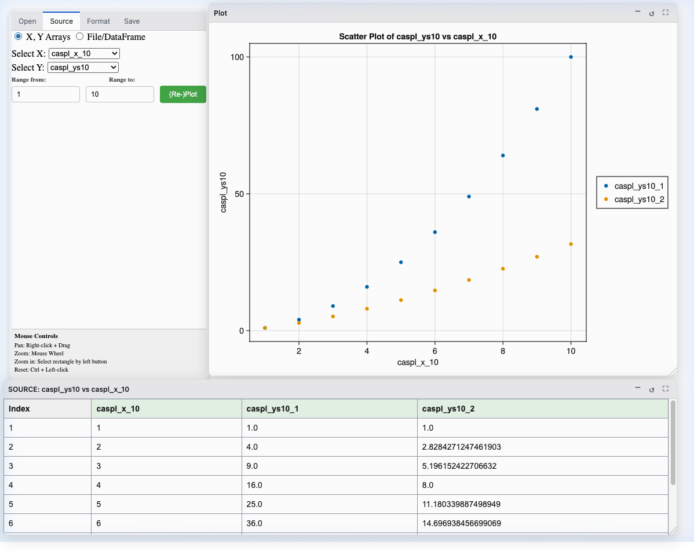
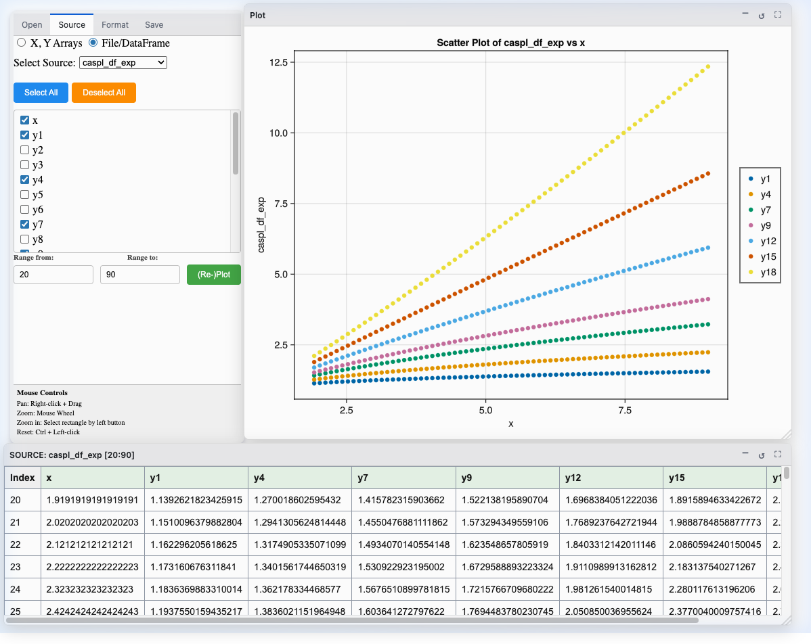
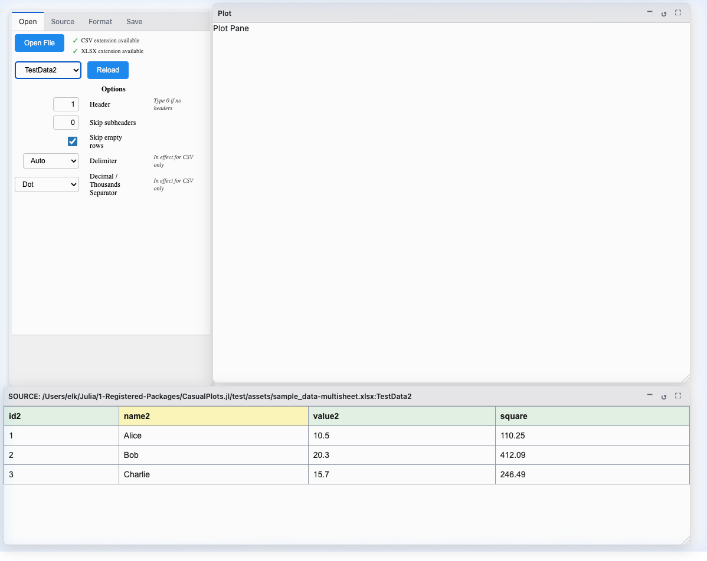
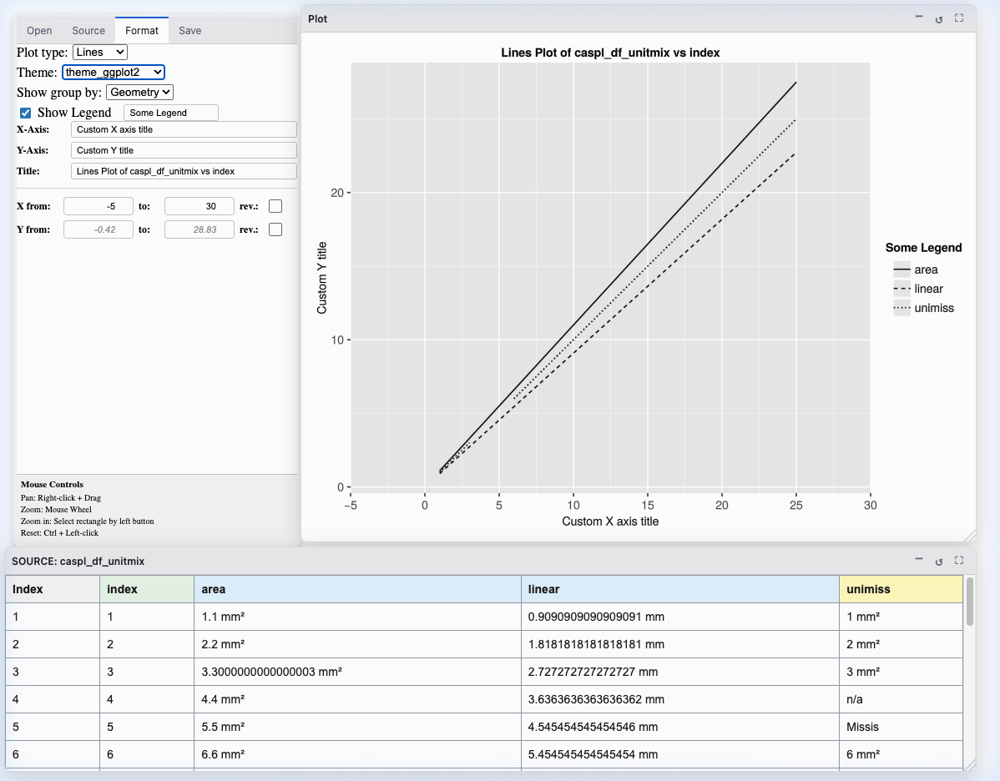
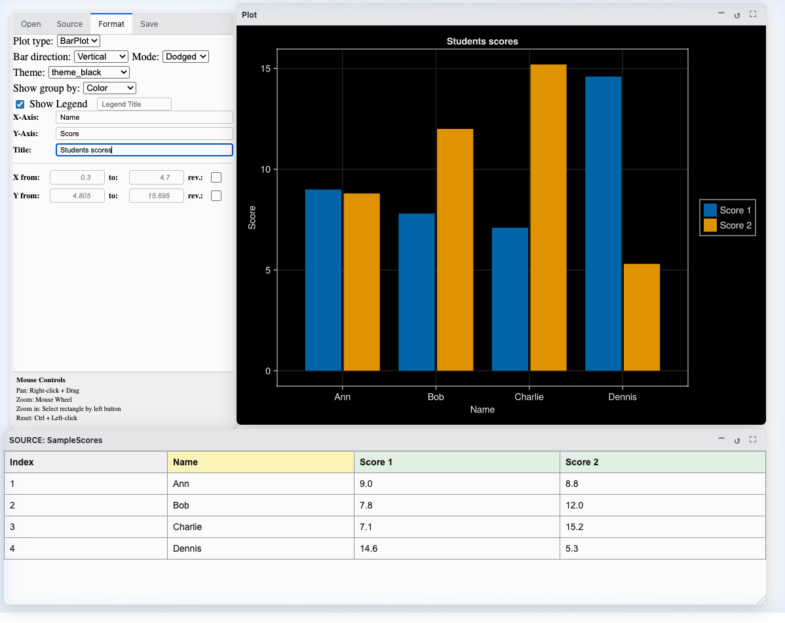
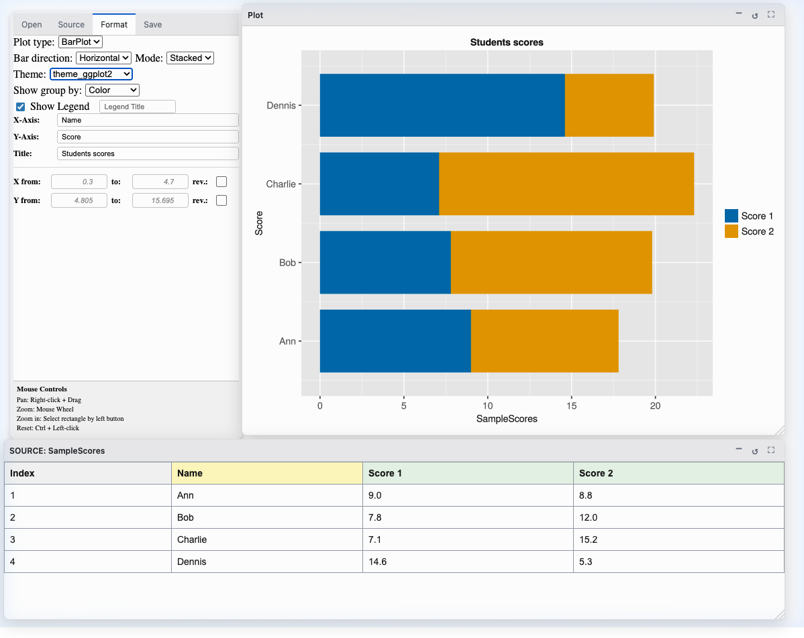
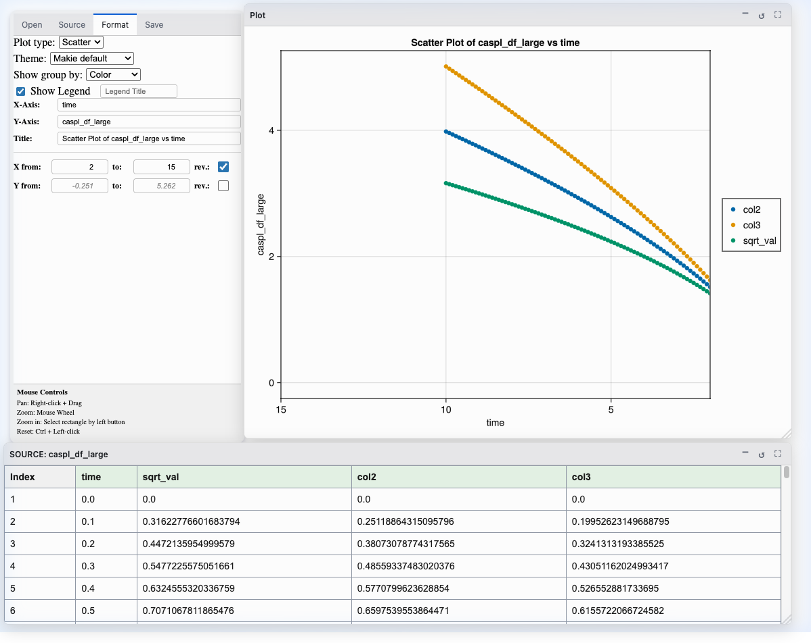
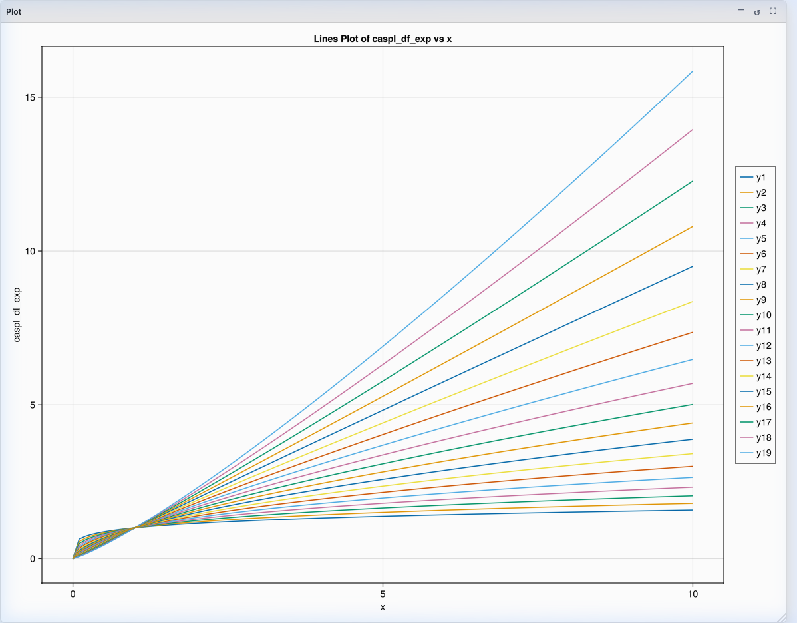
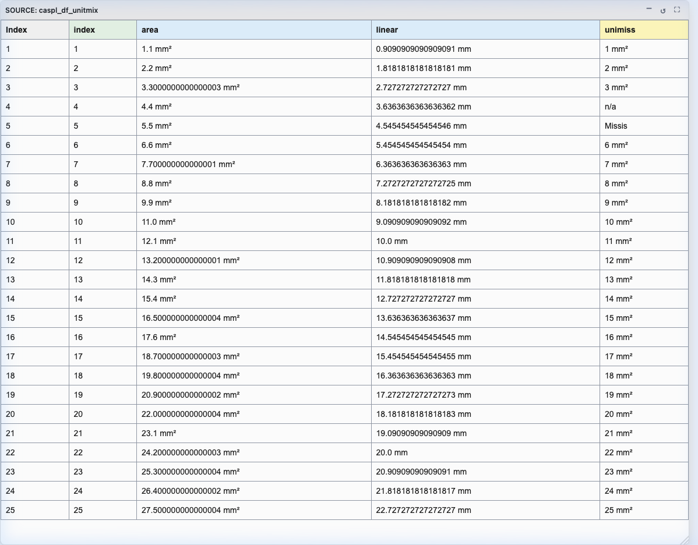
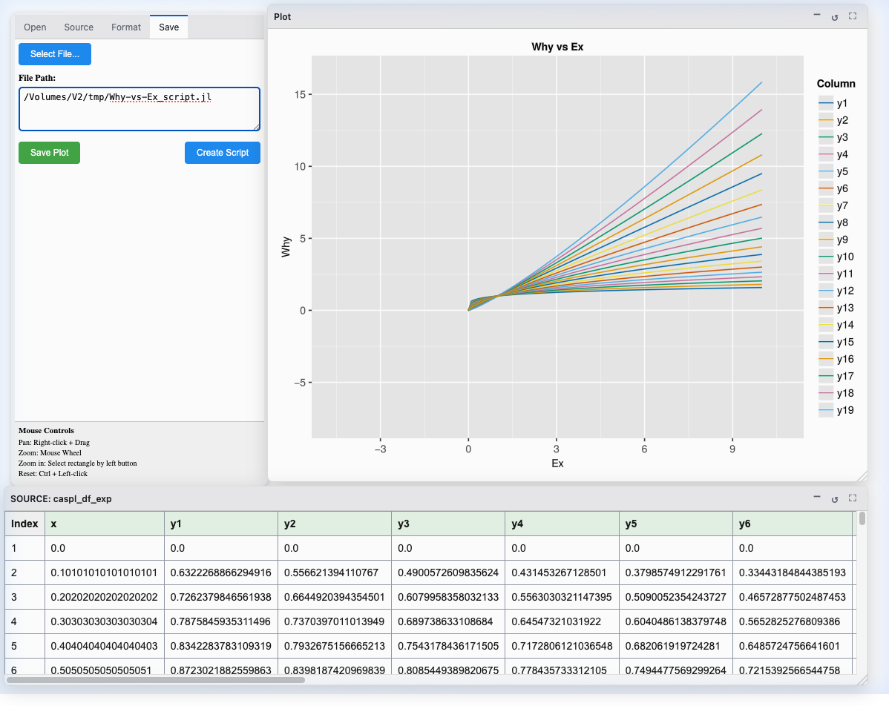

# CasualPlots Tutorial

This tutorial provides a step-by-step walkthrough of common workflows in `CasualPlots.jl`.

## 1. Getting Started & Demo Data

To start the application and populate your environment with sample data:

```julia
using CasualPlots

# Inject demo vectors, arrays, and DataFrames into Main namespace
CasualPlots.@populate

# Launch application instance
app = casualplots_app()

# Serve GUI in Electron window
Ele.serve_app(app)
```

The GUI consists of three main areas:
1. **Control Panel**: Tabbed sidebar containing **Source**, **Format**, **Open**, and **Save** tabs.
2. **Plot Pane**: Floating window displaying the generated plot powered by `WGLMakie.jl`.
3. **Table Pane**: Floating window displaying the active data subset in tabular form.

---

## 2. Data Selection Modes

When using `CasualPlots.jl`, the source selection dropdowns automatically populate with compatible variables found in the Julia `Main` environment.

### a). X, Y Array Mode

1. In the **Source** tab, select **X, Y Arrays** as the Source Type.
2. Choose an X variable (e.g., `caspl_x_10`).
   - *Note: X variables from `Main` must be 1-dimensional arrays (vectors) containing `Real` numbers or `Unitful` quantities.*
3. Select a Y variable of matching length.
   - *Note: Y variables from `Main` can be 1D vectors or 2D matrices containing `Real` numbers or `Unitful` quantities. The first dimension (rows) must match the length of X.*
4. Optionally adjust the row index range (`Range From` / `Range To`).
5. Click **(Re-)Plot** to generate the plot and populate the table.

!!! details "📸 Screenshot: Array X,Y Selection"
    *🔍 [Click to view full resolution](Screenshots/xy_source_selection.png)*
    [](Screenshots/xy_source_selection.png)

---

### b). DataFrame Mode

1. In the **Source** tab, select **DataFrame** as the Source Type.
2. Choose a DataFrame from the dropdown (e.g., `caspl_df_simple`).
3. Select columns using the column checkboxes. The first checked column is assigned to the X-axis, and subsequent checked columns are plotted on the Y-axis.
4. Optionally adjust the row index range (`Range From` / `Range To`).
5. Click **(Re-)Plot**. The DateTable will be filled in, and data plotted

!!! details "📸 Screenshot: DataFrame Selection, every third column selected, a sub-range selected"
    *🔍 [Click to view full resolution](Screenshots/dataframe_source_selection.png)*
    [](Screenshots/dataframe_source_selection.png)

---

### c). File Import (CSV & XLSX)

To load external files from disk:

1. Import [CSV.jl](https://github.com/JuliaData/CSV.jl) or [XLSX.jl](https://github.com/felipenoris/XLSX.jl) *before* starting the GUI, as file reading capabilities are implemented as package extensions for `CasualPlots.jl`.
2. Navigate to the **Open** tab.
3. Configure optional file reading parameters:
   - Header row index (0 for no header).
   - Rows to skip after header.
   - Option to skip empty rows.
   - Delimiter and decimal separator formats for CSV/TSV files.
4. Click **Open File** and select a file.
   - For **CSV** files, data is parsed immediately.
   - For **Excel (XLSX)** files, data is parsed immediately after selecting a sheet from the dropdown.
   - Use the **Reload** button to re-parse the data if you adjust any reading options after the initial load.
5. Loaded file data becomes available under `"opened file"` in the DataFrame source selection dropdown.
6. Proceed in DataFrame Mode.

!!! details "📸 Screenshot: Open Tab & File Reading Options"
    *🔍 [Click to view full resolution](Screenshots/open_file_tab.png)*
    [](Screenshots/open_file_tab.png)

---

## 3. Plot Formatting & Themes

Navigate to the **Format** tab to customize visual parameters.

### a). Lines and Scatter Plots

Select **Lines** or **Scatter** plot type. Options include:
- **Theme Selection**: Choose from predefined themes such as Makie Default, AoG, Dark, Light, Minimal, or ggplot2.
- **Group Differentiation**: Group datasets by **Color** or **Geometry** (linestyle/marker).
- **Titles & Labels**: Custom axis labels and plot titles.
- **Legend Controls**: Toggle legend visibility and edit legend title.

!!! details "📸 Screenshot: Format Tab & Lines Plot, Customized attributes"
    *🔍 [Click to view full resolution](Screenshots/format_tab_lines.png)*
    [](Screenshots/format_tab_lines.png)

---

### b). Bar Plots (Dodged vs Stacked with Categorical Data)

When **BarPlot** is selected with a categorical X column (e.g., categories `Group A`, `Group B`, `Group C`):

- **Bar Mode**: Choose between **Dodged** (bars grouped side-by-side) and **Stacked** (bars stacked vertically).
- **Direction**: Render bars **Vertical** or **Horizontal**.

#### Dodged Mode
!!! details "📸 Screenshot: BarPlot Dodged Mode (Categorical X)"
    *🔍 [Click to view full resolution](Screenshots/format_tab_barplot_dodged.png)*
    [](Screenshots/format_tab_barplot_dodged.png)

#### Stacked Mode
!!! details "📸 Screenshot: BarPlot Stacked Mode, Horizontal (Categorical X)"
    *🔍 [Click to view full resolution](Screenshots/format_tab_barplot_stacked.png)*
    [](Screenshots/format_tab_barplot_stacked.png)

---

### c). Axis Limits & Axis Reversal

In the **Format** tab:
- Set explicit numerical bounds for `X min`, `X max`, `Y min`, and `Y max`.
- Toggle `Reverse X` or `Reverse Y` checkboxes to invert axis directions.
- Zooming and panning in the Plot pane automatically synchronizes back to the limit controls.

!!! details "📸 Screenshot: Axis Limits Controls, customized X-axis"
    *🔍 [Click to view full resolution](Screenshots/format_tab_limits.png)*
    [](Screenshots/format_tab_limits.png)

---

## 4. Resizing Panes

The GUI utilizes a flexible windowing system. The **Plot Pane** and **Table Pane** feature window controls in their top-right corners:

- **Maximize**: Expands the pane to fill the entire available workspace. Maximizing the Plot pane automatically resizes the interactive figure to fit the new dimensions perfectly.
- **Restore**: Returns the layout to its default split view.
- **Minimize**: Collapses the pane.

!!! details "📸 Screenshot: Maximized Plot Pane"
    *🔍 [Click to view full resolution](Screenshots/plot_pane_maximized.png)*
    [](Screenshots/plot_pane_maximized.png)

---

## 5. Data Table & Header Coloring

The **Table Pane** updates dynamically whenever data is plotted.

Column header colors indicate data types:
- 🟩 **Green**: Numeric data (`Float64`, `Int64`).
- 🟦 **Blue**: `Unitful` quantity data (e.g., `10.5u"m"`, `3.2u"s"`).
- 🟨 **Yellow**: String and other non-numeric types; Mixed types (e.g. `Union{String, Int64}`).

!!! details "📸 Screenshot: Maximized Data Table"
    *🔍 [Click to view full resolution](Screenshots/table_view.png)*
    [](Screenshots/table_view.png)

---

## 6. Exporting Plots & Script Generation

Navigate to the **Save** tab:

### Saving Image Files
- Select file or enter filepath, then click **Save Plot** to save static vector or raster outputs (PNG, SVG, or PDF).

### Script Generation
- Click **Create Script** to generate a standalone Julia `.jl` script.
- The generated code uses `AlgebraOfGraphics.jl` and `WGLMakie.jl`/`CairoMakie.jl` to reproduce the plot without requiring the CasualPlots GUI.

!!! details "📸 Screenshot: Save Tab & Code Generation"
    *🔍 [Click to view full resolution](Screenshots/save_tab_script.png)*
    [](Screenshots/save_tab_script.png)
